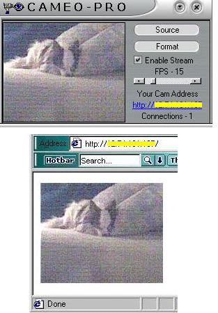



## Cameo\-Pro \(Fixed\)

### Description

Cameo-Pro is a web cam server application. Set the frames per second, enable the stream, and anyone with the provided web address will be able to see your sweet little face right on their web browser. Images are updated every second. Code is heavily commented. Please Vote.
 
### More Info
 

             |
---                |---
**Submitted On**   |2001-01-07 20:46:32
**By**             |[CovertLoop](https://github.com/Planet-Source-Code/PSCIndex/blob/master/ByAuthor/covertloop.md)
**Level**          |Intermediate
**User Rating**    |4.9 (94 globes from 19 users)
**Compatibility**  |VB 6\.0
**Category**       |[Internet/ HTML](https://github.com/Planet-Source-Code/PSCIndex/blob/master/ByCategory/internet-html__1-34.md)
**World**          |[Visual Basic](https://github.com/Planet-Source-Code/PSCIndex/blob/master/ByWorld/visual-basic.md)
**Archive File**   |[CODE\_UPLOAD13517172001\.zip](https://github.com/Planet-Source-Code/covertloop-cameo-pro-fixed__1-14233/archive/master.zip)

